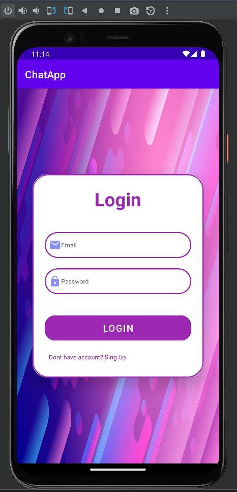
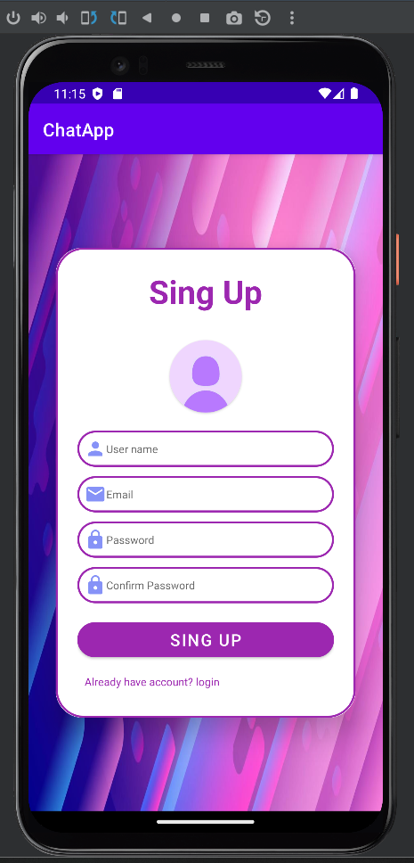
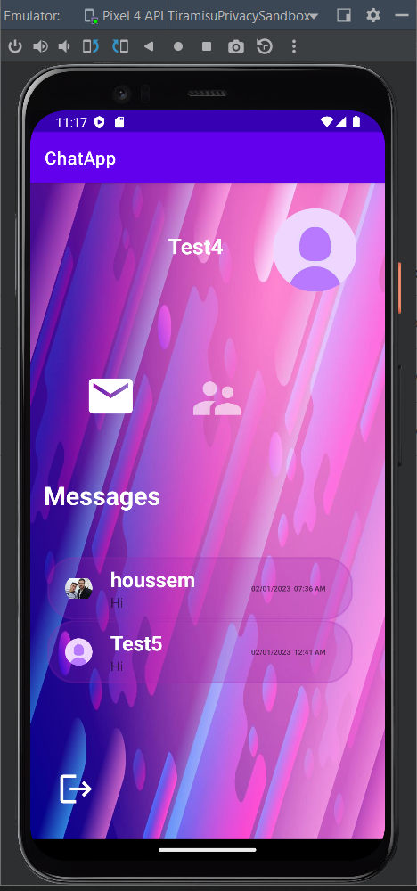
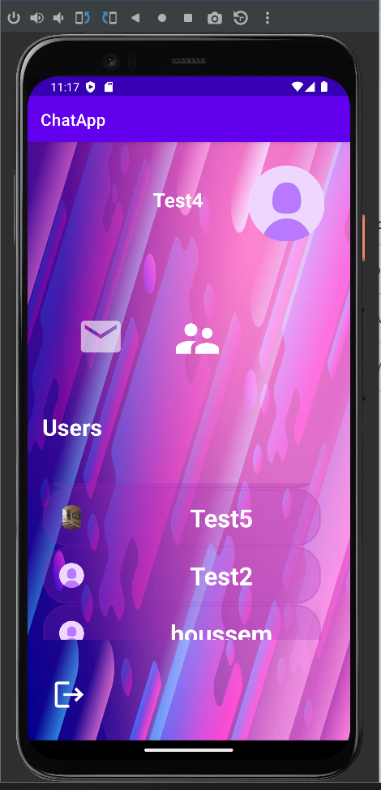
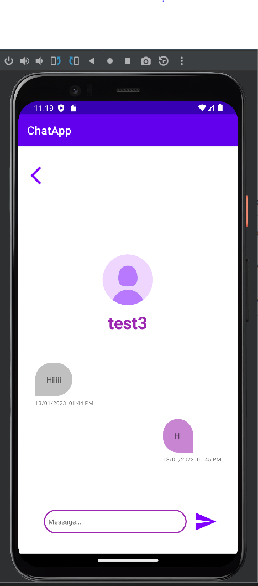

## Project Description
Simple Chat Application
Welcome to the Simple Chat Application! This is a basic real-time chat application built using Android Studio, Java, and Firebase. Whether you're looking to learn the fundamentals of app development or just want a simple messaging platform, this project serves as an excellent starting point.

Features
Real-time Messaging: Engage in seamless real-time conversations with friends and family. Messages are delivered instantly, creating a dynamic chatting experience.

User Authentication: Securely sign up and log in to the app using your email and password. Firebase Authentication ensures that your data remains private.

User Profiles: Personalize your profile with a display name and profile picture. Show off your unique identity to other users in the chat.

Message Status: Know when your messages have been sent, delivered, and read with status indicators. Stay informed about the progress of your conversations.

Getting Started
Clone the Repository: Start by cloning this repository to your local machine using the git clone command.

Firebase Setup: Create a Firebase project and configure the Firebase Authentication and Firestore services. Replace the Firebase configuration files in the app with your own settings.

Run the App: Open the project in Android Studio and run the app on your emulator or physical device. Make sure your device is connected to the internet.

Start Chatting: Log in with your credentials or create a new account. Begin sending and receiving messages in real time.

Screenshots

My portfolio :

Demo video :

